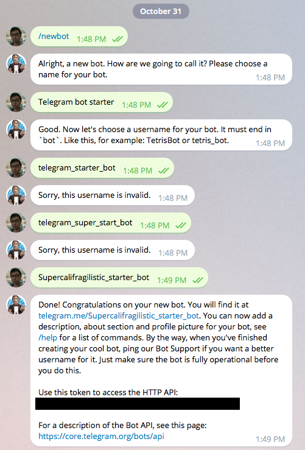
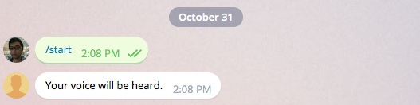

# telegram-bot-starter
Ruby starter for you to build your [Telegram bot](https://telegram.org/blog/bot-revolution).

# Requirement

- docker
- Telegram client

# Setup and use
## Step 1 Register your bot

Talk to @BotFather([https://telegram.me/BotFather](https://telegram.me/BotFather)) and create a new bot.



Store the key supposedly shown in that dark rectanglar area for later
use.

## Step 2 Kickstart the backend

```bash
$ git clone https://github.com/tommyku/telegram-bot-starter
$ cd telegram-bot-starter
$ cp env.yml.example env.yml
$ nano env.yml
```

Now insert the key you got from @BotFather in step 1 to `env.yml` and save the file.

```yaml
TELEGRAM_BOT_TOKEN: '12345:ABCEDFGHIJKLMN'
```

Next, build your bot with docker.

```bash
$ docker build -t telegram-bot-starter .
$ docker run -d -v $(pwd):/app telegram-bot-starter ruby telegram-bot-starter.rb

```

At this point, your bot is ready to receive command from anyone texting it, specifically the `/start` comamnd.

It does not know how to respond to anything else yet.

## Step 3 Test the backend

From your Telegram client, text your bot `/start` and you should be able to see a reply from your own bot.


